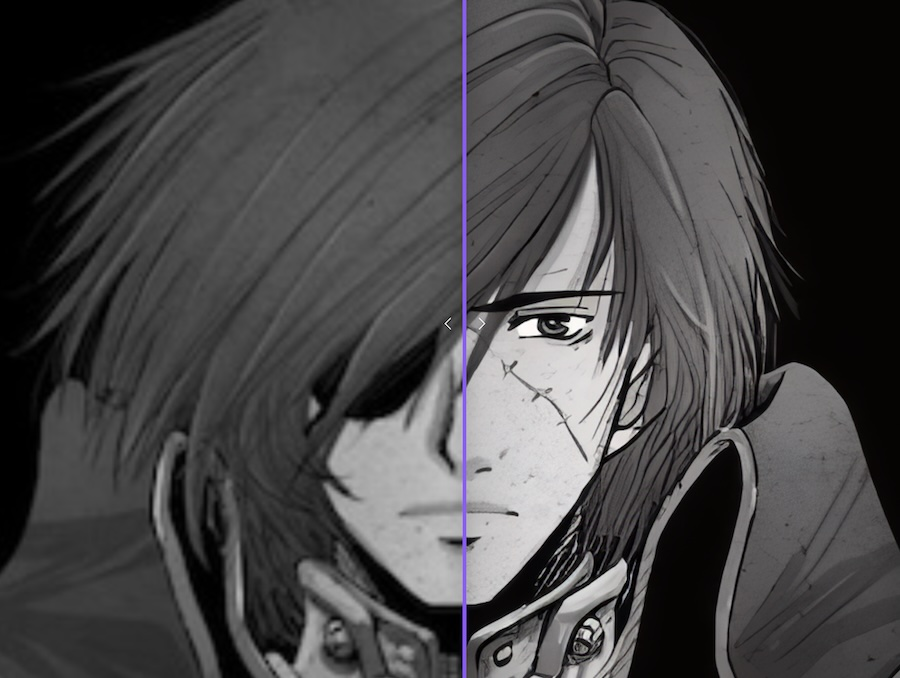

# DistillSR Web ✨

> Transform your low-resolution images into stunning, high-quality, higher dpi images directly in your browser.

[](https://vuejs.org/)
[](https://onnxruntime.ai/)
[](https://tailwindcss.com/)
[](https://www.w3.org/TR/webgpu/)
[](https://rsbuild.rs/)
[](https://creativecommons.org/licenses/by-nc/4.0/deed.en)
[](https://upscaler.renderlab.cc)

[Live demo](https://upscaler.renderlab.cc)

## 🚀 Features

- **🖼️ AI-Powered Upscaling**: Increase image resolution by 4x with no hallucination
- **⚡ Browser-Native**: Runs entirely in your browser using ONNX Runtime Web
- **🎯 GPU Acceleration**: Leverages WebGPU for lightning-fast processing
- **🧩 Tile-Based Processing**: Handles large images efficiently with smart tiling
- **📱 Responsive Design**: Works seamlessly on desktop and mobile devices
- **🔒 Privacy First**: Your images never leave your device

## 🎯 How It Works

The application uses an ML trained vision model trained for super-resolution tasks. 
See [distillsr repo](https://github.com/hirako2000/distillsr) for more info.

When you upload an image:

1. **Image Analysis** - The image is analyzed and divided into optimized tiles
2. **Processing** - Each tile is processed through the neural network
3. **Smart Stitching** - Tiles are seamlessly blended together with overlap handling
4. **4x Upscaling** - The result is a high-resolution image with enhanced details

## 🛠️ Stack

- **Frontend Framework**: [Vue.js](https://vuejs.org/) with Composition API
- **AI Inference**: ONNX Runtime Web with WebGPU/WASM backends
- **Styling**: Beautiful, responsive design with [Tailwind CSS](http://tailwindcss.com/)
- **Image Processing**: Canvas API for pixel-perfect preview & comparison 
- **Routing**: Vue Router


## 🚦 Getting Started

For dev...

### Prerequisites

- Node.js 20+
- npm (or better, pnpm)
- Modern browser with WebGPU support (optional but recommended)

### Installation

```bash
# Clone the repository
git clone https://github.com/hirako2000/distillsr-web.git

# Navigate to project directory
cd distillsr-web

# Install dependencies
pnpm install # or npm

# Start development server
pnpm run dev
```

### Build for Production

```bash
pnpm run build
```

## 🎮 Usage

1. **Upload** - Click & Select any image from your device, or drop it
2. **Process** - Click to process and watch the magic happen
3. **Download** - Save your enhanced image


There are things the model itself cannot do, so this is done on the browser. Nothing is done on a server, other than serving the static files.

### Tiling
- Dynamic tile sizing based on image dimensions
- Overlap handling to eliminate visible seams
- Progress tracking with percentage completion


## 📊 Performance

- **Small Images** (< 512x512): 1-6 seconds
- **Medium Images** (512x512 - 1024x1024): 4-12 seconds  
- **Large Images** (> 1024x1024): 10-20 seconds

_Performance varies based on hardware and image complexity, and that's assuming GPUs enabled_

Images greater than 1200px are scaled down before processing. It's an upscaler, so the output will be 4 times 1200x1200px for large drops.

## 🧪 Browser Support

| Browser | WebGPU | WebAssembly |
|---------|--------|-------------|
| Chrome | ✅ | ✅ |
| Brave | ✅ | ✅ |
| Edge 113+ | ? | ? |
| Firefox | ? | ? |
| Safari | ? | ? |

It may work on other browsers. But I admit I have no patience to see how Safari or IE would handle subtleties. If you raise an issue for those, I may respond to use a Chrome based browser such as Brave, or Vivaldi.

## 🤝 Contributing

Contributions are welcome! Here's how you can help:

1. Fork the repository
2. Create a feature branch (`git checkout -b feature/amazing-feature`)
3. Commit your changes (`git commit -m 'Add amazing feature'`)
4. Push to the branch (`git push origin feature/amazing-feature`)
5. Open a Pull Request

## 📝 License

This work is licensed under a **Creative Commons Attribution-NonCommercial 4.0 International License**.

### You are free to:

- **Share** — copy and redistribute the material in any medium or format
- **Adapt** — remix, transform, and build upon the material

### Under the following terms:

- **Attribution** — You must give appropriate credit, provide a link to the license, and indicate if changes were made. You may do so in any reasonable manner, but not in any way that suggests the licensor endorses you or your use.

- **NonCommercial** — You may not use the material for commercial purposes.

- **No additional restrictions** — You may not apply legal terms or technological measures that legally restrict others from doing anything the license permits.


For the complete license details, visit [creativecommons.org/licenses/by-nc/4.0](https://creativecommons.org/licenses/by-nc/4.0/legalcode)

| Permissions | Restrictions |
|-------------|--------------|
| ✓ Sharing | ✗ Commercial use |
| ✓ Adaptation | ✗ Additional restrictions |
| ✓ Modification | All you want |


## 🙏 Ack

- Built with the amazing [ONNX Runtime](https://onnxruntime.ai/) Web library
- Inspired by the need for privacy-focused, client-side AI tools

*Made with ❤️ for the open-source community*

**⭐ Star this repository if you find it useful!**
